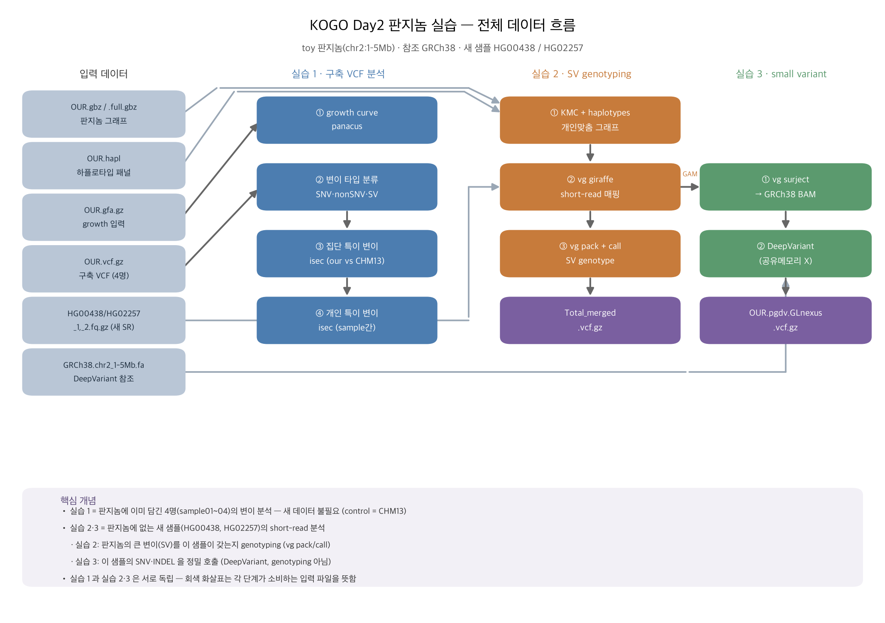
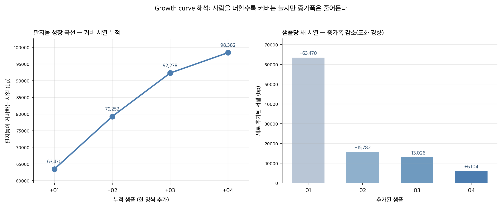

# KOGO 2026 판지놈(Pangenome) 실습 — 재현 파이프라인과 교육자료

2026 KOGO 통계유전학 워크숍 Day2 판지놈 실습을 **자체 HPC(SLURM)에서 처음부터 끝까지
재현**한 기록입니다. 실행 스크립트, 단계별 코드 레퍼런스, 초보자용 교육자료, 그리고
강사 정답과의 대조 검증 결과를 담았습니다.

- **대상 데이터:** toy 판지놈 (GRCh38 chr2:1–5Mb), 구축 샘플 4명 + 대조 CHM13,
  판지놈 미포함 신규 short-read 샘플 2명 (HG00438, HG02257)
- **검증 결과:** 17개 항목 중 **16개가 강사 정답과 정확히 일치** (나머지 1개는 원인 규명 완료)
- **소요 시간:** 전체 파이프라인 16분 16초 (SLURM 단일 잡)



---

## 실습 구성 (3부)

| 실습 | 내용 | 핵심 도구 | 입력 |
|---|---|---|---|
| **1** | 판지놈 구축 VCF 분석 — growth curve, 변이 타입 분류, 집단·개인 특이 변이 | panacus, bcftools | `OUR.gfa.gz`, `OUR.vcf.gz` |
| **2** | 신규 샘플 SV genotyping | KMC, vg (giraffe/pack/call) | `OUR.gbz`, `OUR.hapl`, FASTQ |
| **3** | 신규 샘플 small variant calling | vg surject, pangenome-aware DeepVariant, GLnexus | GAM, GRCh38 FASTA, `OUR.gbz` |

> **중요한 개념 구분:** 실습 1은 *판지놈에 이미 담긴* 샘플을 분석하고, 실습 2·3은
> *판지놈에 없는 새 샘플*을 분석합니다. 실습 2는 **아는 변이의 유전형 판정(genotyping)**,
> 실습 3은 **변이를 새로 찾기(calling)** 로 목적이 다릅니다. 두 갈래는 서로 독립입니다.

---

## 문서 (읽는 순서 권장)

| # | 문서 | 내용 |
|---|---|---|
| — | [**SETUP.md**](docs/SETUP.md) | **설치·실행 절차** — clone부터 결과 확인까지 단계별 |
| — | [GUIDE.md](docs/GUIDE.md) | 실행 요약 · SLURM 예시 · 산출물 구조 |
| 1 | [교육자료_판지놈실습](docs/01_교육자료_판지놈실습.md) | **초보자용** — 각 단계를 왜 하는지, 결과를 어떻게 해석하는지 |
| 2 | [GFA·GBZ 이해](docs/02_GFA_GBZ_이해.md) | 판지놈 파일 포맷 — GFA / rGFA / GBZ 개념과 실무 포인트 |
| 3 | [DeepVariant 이해](docs/03_DeepVariant_이해.md) | 딥러닝 변이 호출 원리 + 판지놈 버전의 차이 |
| 4 | [참고문헌 읽기 가이드](docs/04_참고문헌_읽기가이드.md) | 논문의 **어느 그림·절**을 보면 이해가 빠른지 |
| 5 | [단계별 코드 레퍼런스](docs/05_단계별_코드레퍼런스.md) | 모든 명령의 **입력·출력·옵션 의미** 완전 정리 |
| 6 | [**주요 결과 정리**](docs/06_주요결과_정리.md) | **결과 수치와 해석 + 강사 정답 대조 검증** |

---

## 빠른 시작

> ⚠️ **이 저장소에는 코드·문서만 있고 실습 데이터·툴(약 3.3GB)은 포함돼 있지 않습니다.**
> 워크숍에서 배포된 데이터와 툴 바이너리·컨테이너 이미지를 아래 구조로 직접 배치해야
> 실행됩니다. 라이선스·용량 문제로 재배포하지 않습니다.

### 경로 3분리 — 데이터는 공유, 코드·산출물은 각자

스크립트는 세 위치를 **독립적으로** 다룹니다. 여러 사람이 같은 데이터를 쓰면서 각자 자기
디렉터리에서 작업할 수 있고, **공유 데이터 폴더에는 아무것도 쓰지 않습니다**(읽기 전용 마운트여도 동작).

| 구분 | 무엇 | 어떻게 정해지나 |
|---|---|---|
| **CONDA** | 실행 환경 (bcftools·panacus 등) | `$KOGO_ENV` → 기본 `/data1/dansay/conda/envs/kogo` (자동 활성화) |
| **CODE** | 이 저장소 (스크립트·문서) | 스크립트 위치에서 자동 |
| **DATA** | `01_data_prepare/`, `tools/` — 공유·읽기 전용 | `$KOGO_DATA` → 없으면 코드 옆/상위 자동 탐색 |
| **WORK** | 모든 산출물 | 2번째 인자 → `$KOGO_OUT` → **현재 디렉터리**`/kogo_run` |

> 단계별 상세 안내는 **[docs/SETUP.md](docs/SETUP.md)** 에 있습니다 (private 저장소 인증,
> SLURM 배치, 결과 확인, 문제 해결 포함).

### 1단계 — 원하는 디렉터리에 clone하고 데이터 위치 지정

```bash
# 원하는 위치에 clone (마지막 인자가 목적지 — 홈이 아니어도 됩니다)
git clone https://github.com/DAN-SOO/pangenome_tutorial_2608.git \
    <작업 디렉토리>

# 이후 편의를 위한 변수 (~/.bashrc 에 넣어두면 매번 안 써도 됩니다)
# KOGO_DATA는 고정 변수입니다. 혹은 데이터 복사해가도 됩니다. 
export KOGO_CODE=<작업 디렉토리>
export KOGO_DATA=/data1/dansay/test/pangenome_kogo_2026     # 공유 데이터 위치
```

`$KOGO_DATA` 아래에 있어야 하는 구조 — **이 저장소에는 포함돼 있지 않습니다**:

```
$KOGO_DATA/
├── 01_data_prepare/
│   ├── 00_toy_pangenome/     # OUR.gbz, OUR.full.gbz, OUR.gfa.gz, OUR.hapl,
│   │                         # OUR.vcf.gz(+.tbi), GRCh38.chr2_1-5Mb.fa(+.fai)
│   └── 01_srWGS/             # HG00438_{1,2}.fq.gz, HG02257_{1,2}.fq.gz
└── tools/
    ├── vg167_kmc324/bin/     # vg 1.67.0 + KMC 3.2.4  (실습2-① 전용)
    ├── vg174_kmc324/bin/     # vg 1.74.1              (매핑·콜·surject)
    └── deepvariant_pangenome_aware_1.8.0.sif          # 실습3 (약 3.1GB)
```

> 데이터를 저장소 안에 두고 쓰던 기존 방식(저장소 루트에 `01_data_prepare/`·`tools/` 배치
> 또는 심볼릭 링크)도 그대로 동작합니다 — 그 경우 `KOGO_DATA` 없이 자동 인식됩니다.

데이터가 제대로 있는지 확인 (체크섬 검증):

```bash
bash "$KOGO_CODE/scripts/check_data.sh"
# → "일치 19 / 없음 0 / 불일치 0" 이면 준비 완료
```

필요한 파일의 전체 목록·크기·SHA-256은 [docs/DATA_MANIFEST.md](docs/DATA_MANIFEST.md)에
있습니다.

### 2단계 — 환경 구성 및 실행

```bash
bash "$KOGO_CODE/scripts/00_setup_env.sh"     # conda 환경 생성 (1회, 이미 있으면 생략)

# 자기 작업 폴더로 이동해서 실행 — 산출물이 여기에 생깁니다
mkdir -p /data1/dansay/run/pangenome_run && cd /data1/dansay/run/pangenome_run
bash "$KOGO_CODE/scripts/run_all_kogo_day2.sh" all   # 전체 (실습1→2→3)
```

phase를 나눠서도 실행할 수 있습니다:

```bash
bash "$KOGO_CODE/scripts/run_all_kogo_day2.sh" 1   # 실습1만 (bcftools·panacus)
bash "$KOGO_CODE/scripts/run_all_kogo_day2.sh" 2   # 실습2만 (KMC·vg)
bash "$KOGO_CODE/scripts/run_all_kogo_day2.sh" 3   # 실습3만 (surject·DeepVariant)
```

**산출물 위치 지정** — 기본은 `현재 디렉터리/kogo_run` 입니다. 바꾸려면:

```bash
KOGO_OUT=/scratch/$USER/kogo_run bash "$KOGO_CODE/scripts/run_all_kogo_day2.sh" all
# 또는 2번째 인자로:
bash "$KOGO_CODE/scripts/run_all_kogo_day2.sh" all /scratch/$USER/kogo_run
```

실행 시작할 때 세 경로를 출력하니 확인하세요:

```
[INFO] CONDA = /data1/dansay/conda/envs/kogo
[INFO] CODE  = /data1/dansay/tools/pangenome_tutorial_2608/scripts
[INFO] DATA  = /data1/dansay/test/pangenome_kogo_2026        (읽기 전용)
[INFO] WORK  = /data1/dansay/run/pangenome_run/kogo_run      (산출물)
```

필수 입력이 없으면 어떤 파일이 어디에 있어야 하는지 안내하고 종료합니다. 산출물 폴더를
공유 데이터 폴더 안에 지정하면 경고가 나옵니다.

### 환경 요구사항

| 실행 범위 | 요구사항 |
|---|---|
| **실습1만** | conda/mamba + bcftools · **panacus 0.4.1** · cyvcf2 — macOS도 가능\* |
| **실습2·3** | **Linux x86_64** (vg·KMC·DeepVariant는 이 플랫폼 전용) + apptainer 또는 singularity |

\* macOS에서는 BSD grep이 `-P`를 지원하지 않아 집단특이 단계에서 빈 결과가 나옵니다
(`grep -P` → `-E` 치환 필요). Linux GNU grep에서는 원본 그대로 동작합니다.

SLURM 환경 예시와 HPC별 함정은 [docs/GUIDE.md](docs/GUIDE.md)를 참조하세요.

---

## 주요 결과 요약

### 실습 1 — 판지놈 구축 VCF (총 19,877 변이)

| 항목 | 결과 |
|---|---|
| 변이 타입 | SNV **16,149** (81%) · non-SNV **3,728** · 그중 SV(≥50bp) **415** |
| 집단 특이 (vs CHM13) | SNV **10,430** (65%) · non-SNV **2,047** · SV **202** (49%) |
| Growth curve | sample01 63,470 bp → sample04 누적 **98,382 bp** (증가폭 15,782 → 6,104으로 감소) |
| 코어 vs 액세서리 | 4명 전원 공유(코어) **36,041 bp** = 전체의 **약 37%** |



### 실습 2 — 신규 샘플 SV genotyping

| 샘플 | 전체 read | 그래프 정렬 | 비율 |
|---|---|---|---|
| HG00438 | 1,230,694 | 805,888 | 65.5% |
| HG02257 | 1,265,686 | 814,909 | 64.4% |

최종 `Total_merged.chr2_1-5Mb.vcf.gz` — **5,040개** (병합 + PASS 필터)

### 실습 3 — 신규 샘플 small variant calling

| 항목 | 결과 |
|---|---|
| surject (HG00438) | mapped **804,384 (65.36%)** — 그래프→선형 좌표 변환 손실 0.2% |
| DeepVariant 샘플별 | HG00438 **21,838** · HG02257 **21,733** |
| GLnexus 통합 | unify 단계 **6,712** 사이트 (대립 5,955개 품질 탈락) → 최종 VCF 레코드 **6,703** |

---

## 검증 — 강사 정답과의 대조

강사가 제공한 정답 출력 파일과 재현 결과를 직접 비교했습니다.

**17개 항목 중 16개 완전 일치.** 유일한 차이는 GLnexus 통합 단계(재현 6,703 vs 강사
6,696, **일치율 99.87%**)이며, 원인을 규명했습니다: 입력 per-sample VCF와 GLnexus 버전은
동일하고(`v1.4.1-0-g68e25e5`), 차이 나는 9개 사이트는 **모두 DP 2~3의 극저커버리지
저품질 변이**입니다. 통상적인 depth 필터(DP≥10)를 적용하면 차이가 사라집니다.

전체 대조 표와 상세 해석: [docs/06_주요결과_정리.md](docs/06_주요결과_정리.md)

---

## 재현 시 알아두면 좋은 함정

| 문제 | 해결 |
|---|---|
| growth curve TSV가 0바이트 | panacus 0.5.x 버그 → **`panacus=0.4.1` 고정** |
| DeepVariant `RuntimeError: File exists` | 공용 서버 `/dev/shm` 이름 충돌 → **3단계 직접 호출**(공유메모리 미사용) |
| `apptainer: command not found` | singularity만 있는 서버 → PATH 앞에 `exec singularity "$@"` shim |
| conda `Operation not permitted` | 공용 pkgs 캐시 쓰기 불가 → setup 스크립트가 개인 캐시를 자동 사용 (수동: `export CONDA_PKGS_DIRS=<개인경로>`) |
| `[WARN] conda activate ... 실패` | 지정 환경 없음 → `bash "$KOGO_CODE/scripts/00_setup_env.sh"` 또는 `export KOGO_ENV=<경로\|이름\|skip>` |
| `vg haplotypes` 포맷 오류 | `.hapl`이 구포맷 → 이 단계만 **vg 1.67.0** |
| macOS에서 집단특이가 0 | BSD grep은 `-P` 미지원 → `-E`로 치환 |

---

## 도구 버전

| 도구 | 버전 | 용도 |
|---|---|---|
| vg | 1.67.0 | `vg haplotypes` (구 `.hapl` 포맷 호환) |
| vg | 1.74.1 | giraffe · pack · call · surject |
| KMC | 3.2.4 | k-mer 계수 |
| panacus | **0.4.1** (고정 필수) | growth curve |
| bcftools / htslib | 1.22 계열 | VCF 조작 |
| GLnexus | v1.4.1 | 다중샘플 공동 genotyping |
| DeepVariant | pangenome-aware 1.8.0 | small variant calling |

---

## 참고 문헌

- Li H, Feng X, Chu C (2020). *The design and construction of reference pangenome graphs
  with minigraph.* **Genome Biology** 21:265. doi:10.1186/s13059-020-02168-z
- Poplin R, et al. (2018). *A universal SNP and small-indel variant caller using deep
  neural networks.* **Nature Biotechnology** 36:983–987. doi:10.1038/nbt.4235
- Asri M, et al. (2025). *Pangenome-aware DeepVariant.* **bioRxiv** 2025.06.05.657102.
  doi:10.1101/2025.06.05.657102
- Sirén J, et al. (2021). *Pangenomics enables genotyping of known structural variants in
  5202 diverse genomes.* **Science** 374:abg8871. (vg giraffe)
- [GFA-spec](https://github.com/GFA-spec/GFA-spec) — GFA 포맷 명세
- [vg](https://github.com/vgteam/vg) · [panacus](https://github.com/marschall-lab/panacus)
  · [DeepVariant](https://github.com/google/deepvariant) · [GLnexus](https://github.com/dnanexus-rnd/GLnexus)

---

## 감사

실습 데이터·스크립트·정답 출력을 제공해 주신 2026 KOGO 통계유전학 워크숍 강사·조교분들께
감사드립니다. 이 저장소의 스크립트는 강사 원본 코드를 기반으로 하며, 경로 이식성과
환경 호환성 부분만 수정했습니다.
